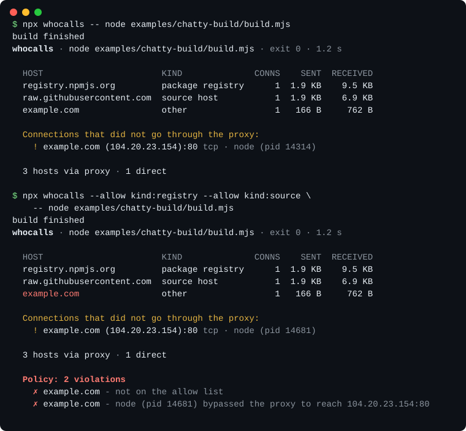
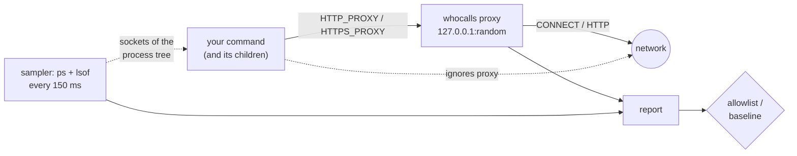

<h1 align="center">whocalls</h1>

<p align="center"><b>See every host a command talks to.</b><br>
A network receipt for <code>npm install</code>, <code>make</code>, a build script, or anything you are about to trust,<br>and a CI allowlist so it stays that way.</p>

<p align="center">
  <a href="https://github.com/Nithinfgs/whocalls/actions/workflows/ci.yml"></a>
  
  
  = 18.17" src="https://img.shields.io/badge/node-%E2%89%A518.17-339933.svg">
</p>

<p align="center"></p>

```sh
npx github:Nithinfgs/whocalls -- npm install
```

> Runs straight from GitHub today, no clone needed. Once it is on npm this becomes `npx whocalls -- npm install`; the examples below use that short form.

## In 20 seconds

You run a lot of code you did not write: install scripts, build steps, `curl | sh`, a coding agent's tool calls. Most of it phones the network, and you rarely know where.

`whocalls` runs your command behind a tiny local proxy and prints the hosts it contacted, how much was sent and received, and which of them are package registries, source hosts, or known telemetry endpoints. A second, independent check watches the process tree's sockets, so a client that **ignores** the proxy still shows up instead of silently escaping the report.

Give it an allowlist and it becomes a CI gate: a new host appearing in your build fails the job.

## Why this exists

Supply-chain incidents keep reaching developers through install and build steps. The usual answers are heavy: a root-level packet capture, a full MITM proxy with a custom CA, or a container firewall. Those are the right tools for some jobs, but they are rarely what you reach for to answer "what does this thing talk to?" in ten seconds.

`whocalls` aims at that gap: no root, no CA to trust, no config, no dependencies, and an honest report of what it could and could not see.

## Install

Requires Node.js 18.17 or newer. macOS and Linux are supported and tested in CI. Windows is untested; the bypass check does not run there.

```sh
# straight from GitHub, today
npx github:Nithinfgs/whocalls -- <command>

# or from a clone
git clone https://github.com/Nithinfgs/whocalls && cd whocalls
node bin/whocalls.js --help

# once published to npm
npx whocalls -- <command>
```

There are no runtime dependencies. `npm install` in the clone only fetches the linters and type checker.

## Examples

Just look:

```sh
whocalls -- npm install
whocalls -- pip install -r requirements.txt
whocalls -- git clone https://github.com/some/repo
```

Fail the build if it talks to anything unexpected:

```sh
whocalls --allow kind:registry --allow github.com --allow '*.githubusercontent.com' -- npm ci
```

Record what a good build looks like, then catch drift:

```sh
whocalls --save .whocalls.json -- make build       # commit this file
whocalls --baseline .whocalls.json -- make build   # in CI: exit 3 on a new host
```

Actually refuse the connection instead of only reporting it:

```sh
whocalls --allow kind:registry --enforce -- npm install
```

Machine-readable output for scripts and dashboards:

```sh
whocalls --json -- ./build.sh > egress.json
```

A runnable demo lives in [`examples/chatty-build`](examples/chatty-build): it makes a registry lookup, a GitHub fetch, a plain-HTTP request, and one connection that ignores the proxy.

### GitHub Actions

```yaml
- run: npx whocalls --baseline .whocalls.json -- npm ci
```

## What you get

- **Host report.** Per host: connections, bytes sent and received, whether any traffic was plain HTTP, whether anything was blocked or failed.
- **Labels.** Package registry, source host, CDN, or *known telemetry* (for example `telemetry.nextjs.org` or `*.ingest.sentry.io`), from a small [hand-maintained list](src/catalog.js). Unlisted means "other", not "bad".
- **Bypass detection.** Connections made by the command or its children that did not go through the proxy, with the process name and pid.
- **Allowlist and baseline.** `--allow` patterns (`host`, `*.domain`, `kind:registry`), `--baseline`/`--save` files, exit code 3 on violation, optional `--enforce`.
- **Chains through your proxy.** If `HTTPS_PROXY`/`NO_PROXY` are already set, `whocalls` forwards through them.
- **Transparent.** Your command's stdout, stderr, stdin and exit code pass through. The report goes to stderr, or to stdout with `--json`.

## How it works



1. A forward proxy starts on a random loopback port. `HTTP_PROXY`, `HTTPS_PROXY`, `ALL_PROXY`, the npm equivalents, and `NODE_USE_ENV_PROXY=1` point your command at it, and `NO_PROXY` is cleared so nothing is exempted.
2. For HTTPS the proxy handles `CONNECT`: it learns the destination host and counts bytes, and **never decrypts anything**. For plain HTTP it also records the path (never the query string).
3. In parallel, `ps` and `lsof` are polled for the command's process tree. Any non-loopback socket that is not the proxy is reported as a direct connection.
4. The report is built, compared against your policy, and the command's own exit code is returned (or `3` if it succeeded but violated policy).

Clients checked against this proxy during development: `curl`, `npm`, `pip`, Python `urllib`, `git`, and Node 24 `fetch`. Anything that honours the standard proxy variables should work.

## Limits, stated plainly

- **It is not a sandbox.** Without `--enforce` it only observes. With `--enforce` it only blocks traffic that uses the proxy. A program that opens its own sockets is reported as a bypass, not stopped. For hard isolation use a container, network namespace, or firewall.
- **Bypass detection is sampling.** Polling every 150 ms (`--interval`) can miss a connection that opens and closes faster than that.
- **No DNS visibility.** DNS lookups made by the command itself are not listed. UDP is only seen when the socket is connected.
- **Direct connections are IPs.** The sampler sees addresses, not names; they are matched to a hostname only when the proxy happened to see the same IP.
- **HTTPS content is invisible by design.** You see the host and sizes, not the URL or body.
- **Programs that refuse proxies** (some JVM tools, statically linked binaries, anything that pins its own resolver) will land under "did not go through the proxy".
- **Windows is untested.** The bypass check needs `lsof` and is skipped there.
- **The telemetry list is short and manual.** Open a PR to add hosts, with a source.

## Configuration

There is no config file. Everything is a flag:

| Flag | Meaning |
| --- | --- |
| `--allow <pattern>` | Hosts you expect. Repeatable or comma-separated. Patterns: `host`, `*.domain`, `kind:registry\|source\|cdn\|telemetry` |
| `--enforce` | Return 403 for proxied connections to hosts that are not allowed (needs `--allow`) |
| `--baseline <file>` | Fail on hosts missing from this file |
| `--save <file>` | Write the contacted hosts to a file |
| `--json` | JSON report on stdout |
| `--include-local` | Include loopback destinations in the report |
| `--no-sample` | Skip the bypass check |
| `--interval <ms>` | Bypass check interval (default 150, minimum 20) |

Exit codes: the command's own status; `3` if it succeeded but violated policy; `2` for bad usage; `127` if the command was not found.

## Use cases

- Look at what an unfamiliar `postinstall` script or build step contacts before you trust it.
- Keep a repo's build honest in CI: a new dependency that suddenly talks to a new host fails the job.
- Find which tools in your toolchain send telemetry, then turn it off on purpose.
- See what a coding agent's shell commands reach out to.
- Debug "works on my machine" proxy and firewall problems: which hosts must the allowlist include?

## Roadmap

- [ ] Linux fallback for the bypass check that reads `/proc` when `lsof` is missing
- [ ] SARIF and GitHub step-summary output
- [ ] `whocalls diff a.json b.json` between two runs
- [ ] A `--watch` mode that streams hosts as they appear
- [ ] Larger, sourced telemetry catalogue

## Development

```sh
npm install
npm run check   # eslint + tsc (checkJs) + node:test
npm run demo    # regenerates docs/assets/demo.svg from real output
```

See [CONTRIBUTING.md](CONTRIBUTING.md). Security reports: [SECURITY.md](SECURITY.md).

## License

[MIT](LICENSE)
